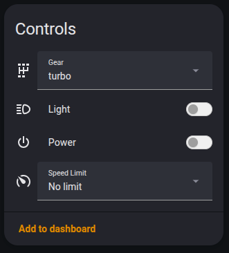
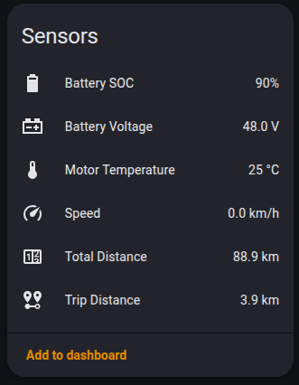
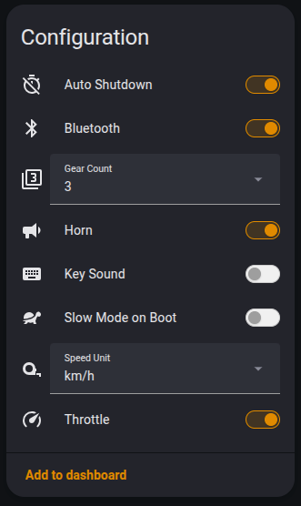
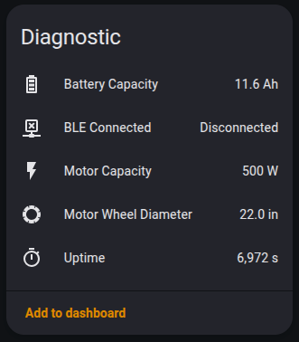

# ESPHome Fiido BMS

[](https://github.com/dzikus/esphome-fiido-bms/actions/workflows/test.yml)
[](https://github.com/dzikus/esphome-fiido-bms/actions/workflows/codeql.yml)
[](https://scorecard.dev/viewer/?uri=github.com/dzikus/esphome-fiido-bms)
[](https://github.com/dzikus/esphome-fiido-bms/releases/latest)
[](LICENSE)

<a href="https://www.buymeacoffee.com/dzikus" target="_blank"></a>

ESPHome external component that exposes a Fiido ebike to Home
Assistant over BLE. One component instance ("hub") per bike. Multiple hubs run on a
single ESP32 with the burst poll of each hub offset in time so the radio is not
contended.

The component reads the bike state out of its BMS, parses the proprietary frames the
official app uses, and writes back to flip a small set of physical controls:
power, light, gear, gear count, speed limit, speed unit, horn, key sound, throttle,
slow mode on boot. A further set (cruise, start mode, insensitivity, show total km,
auto screen off, ring, double speed, display brightness, boost, guard time, watch
pairing) is experimental and off by default. Bike guard is built by default, but its
ON path is incomplete. See [Experimental controls](#experimental-controls).

This README shows how to wire a bike into an ESPHome device and what entities you
get. How the component is structured, how it polls and writes, and how to add a new
sensor, binary sensor, select, switch, number or button are in
[ARCHITECTURE.md](ARCHITECTURE.md). The wire protocol is in [PROTOCOL.md](PROTOCOL.md).

---

## What this is

### Hardware

The component speaks the BLE protocol of the official Fiido app (`com.fiido.meter`).
That protocol is model-agnostic: the same frame format and register map are used
across the adult Fiido ebike line, so the component is not tied to one model. It
was developed and verified empirically on a Fiido C11 Pro and a Fiido M1 Pro 2025;
everything here was confirmed on that hardware unless noted. Other adult Fiido
ebikes exposing the same `Fiido_*` BLE service are likely compatible but untested -
reports and PRs welcome. The K1 / Kidz children's line uses a different register
layout and is not covered.

A Fiido Air owner reports the same frames over a different GATT service, which
`model: air` selects. No Air has been tested with this component; see
[Fiido Air (untested)](#fiido-air-untested).

| Bike                  | BLE name        | MAC (example)       | Spec             |
|-----------------------|-----------------|---------------------|------------------|
| Fiido C11 Pro         | `Fiido_C11Pro`  | `XX:XX:XX:XX:XX:XX` | 48V/11.6Ah, 350W, 28 inch |
| Fiido M1 Pro 2025     | `Fiido_M1PRO`   | `XX:XX:XX:XX:XX:XX` | 48V/11.6Ah, 500W, 22 inch |
| Fiido Air ([untested](#fiido-air-untested)) | not reported | `XX:XX:XX:XX:XX:XX` | 36V, 250W (owner report) |

MACs above are placeholders; scan your bike with any BLE tool to get the real
address and substitute it in `ble_client.mac_address`.

The C11 Pro and M1 Pro 2025 use the same BLE topology and the same wire protocol, and
both switch between 3-gear and 5-gear mode. The Air is single-speed (owner report).

ESP32 side: any board capable of `esp32_ble_tracker` + `ble_client` plus enough
RAM/Flash headroom (component baseline: ~16% RAM, ~47% Flash on ESP32 with
`esp-idf` framework). The reference deployment uses an ESP32 with LAN8720 Ethernet
but Wi-Fi works too.

### BLE topology (identical on both bikes)

| Service                                  | Characteristic                            | Use         |
|------------------------------------------|-------------------------------------------|-------------|
| `00010203-0405-0607-0809-0A0B0C0DFFE0`   | `...FFE1` handle 0x12 (NOTIFY)            | Rx          |
| `00010203-0405-0607-0809-0A0B0C0DFFE0`   | `...FFE2` handle 0x10 (WRITE + WRITE_NR)  | Tx          |
| `0xFE59`                                 | Nordic Secure DFU                         | not used    |

Negotiated MTU: 247. The component does no DFU and never writes to `0xFE59`.

Fiido Air profile, per the owner report:

| Service                                  | Characteristic                                    | Use |
|------------------------------------------|---------------------------------------------------|-----|
| `c3e6fea0-e966-1000-8000-be99c223df6a`   | `c3e6fea2-e966-1000-8000-be99c223df6a` (NOTIFY)   | Rx  |
| `c3e6fea0-e966-1000-8000-be99c223df6a`   | `c3e6fea1-e966-1000-8000-be99c223df6a` (WRITE)    | Tx  |

The hub looks up both characteristics by UUID in the profile selected by `model`.
[`PROTOCOL.md`](PROTOCOL.md#transport) lists both profiles.

### What it exposes per bike

Each platform block (`sensor:`, `switch:` and so on) pointed at a hub creates the
entities of that platform listed below. Dev entities are created only with
`expose_dev_sensors: true` on the hub and start disabled in Home Assistant
(`disabled_by_default: true`) until you enable them per entity.

- Sensors: 10 by default (battery voltage, battery capacity, motor wheel diameter,
  motor temperature, motor capacity, speed, trip distance, total distance, battery
  SOC, uptime) and 26 dev (hardware and software
  versions, manufacturers, battery current and current voltage, controller voltage
  limits, current and temperature, motor construction data, crank torque and RPM,
  trip and total energy, meter mode data, gear start).
- Binary sensors: `connected` (BLE link state) and `pas_limit` (STATS 0x2C bit 7) by
  default, `brake` (STATS 0x2A bit 5, hardware behaviour not user-verified) as dev.
- Selects, all by default: `gear` (OFF plus 3 or 5 gears, following the gear count),
  `mode` (gear count 3 / 5, left out with [`ui_gear_mode_3: true`](#hub-options)),
  `speed_limit` (6 km/h / 25 km/h / No limit), `speed_unit` (km/h / mph).
- Switches: 9 by default (`motor` (Power), `light`, `auto_shutdown`, `speaker`
  (Horn), `key_sound`, `throttle`, `slow_mode_on_boot`, `bluetooth` (BLE link master
  switch), `bike_guard`) and 7 dev (`cruise`, `start_mode`, `insensitivity`,
  `show_total_km`, `auto_screen_off`, `ring`, `double_speed`). See
  [Experimental controls](#experimental-controls).
- Numbers, all dev: `guard_time`, `brightness`, `boost`.
- Button, dev: `pair_watch`.

A `model: air` hub builds fewer entities; see [Fiido Air (untested)](#fiido-air-untested).

### Screenshots

The component in Home Assistant, shown as the device page split into its four
entity-category cards:






---

## Configuration (YAML)

### Minimum config

This component uses the ESPHome sub-device API, the device-aware duplicate-name check
and `select::Select::current_option`, so it needs **ESPHome 2026.1.0 or newer**. Pin
it with `esphome: { min_version: 2026.1.0 }` so an older install fails fast instead
of erroring deep in code generation.

Two declarations per bike. Replace the MAC with the bike's MAC.

```yaml
external_components:
  - source: github://dzikus/esphome-fiido-bms
    components: [fiido_bms]

esp32_ble_tracker:

ble_client:
  - id: ble_c11
    mac_address: XX:XX:XX:XX:XX:XX

fiido_bms:
  - id: hub_c11
    ble_client_id: ble_c11

sensor:
  - platform: fiido_bms
    fiido_bms_id: hub_c11

binary_sensor:
  - platform: fiido_bms
    fiido_bms_id: hub_c11

select:
  - platform: fiido_bms
    fiido_bms_id: hub_c11

switch:
  - platform: fiido_bms
    fiido_bms_id: hub_c11

number:
  - platform: fiido_bms
    fiido_bms_id: hub_c11

button:
  - platform: fiido_bms
    fiido_bms_id: hub_c11
```

That gives you all default entities, named in English, with default icons and
restore modes. Every individual entity can be customised; see
[Override per-entity](#override-per-entity) below.

### Hub options

Set on the `fiido_bms:` entry, not on the platforms.

| Option                | Type     | Default | Effect                                                                                          |
|-----------------------|----------|---------|-------------------------------------------------------------------------------------------------|
| `ble_client_id`       | id       | -       | Required. Points to the `ble_client` entry for this bike's MAC.                                 |
| `model`               | enum     | unset   | `c11_pro`, `m1_pro_2025` or `air`. Selects the GATT profile and, for `air`, the entity set. Unset: FFE0 profile, all entities. `c11_pro` and `m1_pro_2025` match unset and add a `Model:` line to `dump_config`. `air` rejects `ui_gear_mode_3: true` and `enforce_gear_mode_3: true`. See [Fiido Air (untested)](#fiido-air-untested). |
| `startup_delay`       | time     | `0s`    | Delays the first poll after connect, and sets this hub's burst phase for the whole uptime. Auto-derived from `hub_index` if omitted; set the same value on two hubs and their bursts collide. |
| `update_interval_on`  | time     | `3s`    | Burst rotation period while motor controller is ON (bit 7 ADDR 0x27 set).                       |
| `update_interval_off` | time     | `15s`   | Burst rotation period while motor controller is OFF. Fast enough to catch a physical power-on.  |
| `idle_disconnect`     | time     | `15min` | After motor has been OFF this long with no pending writes, the BLE link is dropped.             |
| `expose_dev_sensors`  | bool     | `false` | When true, the dev sensors, the dev binary sensor, the 7 dev switches, all 3 numbers and the `pair_watch` button are created (disabled in HA). When false none of them reach the build at all. |
| `name_prefix`         | string   | unset   | Prepended to the **default** name of every entity of this hub, so two bikes on one node stop sharing entity names. A name you set yourself is never touched. Set to `""` to keep the defaults and silence the multi-hub warning. See [Entity names with two bikes](#entity-names-with-two-bikes). |
| `ui_gear_mode_3`      | bool     | `false` | HA UI only: hides the `mode` select and shrinks `gear` to 4 options. Does not change BMS state. |
| `enforce_gear_mode_3` | bool     | `false` | Runtime: writes mode 3 to BMS when STATS reports 5-gear while the motor controller is ON (60s cooldown, ble_user_enabled). |
| `update_interval`     | time     | `1s`    | PollingComponent baseline tick. The component runs an adaptive gate on top.                     |

The auto-offset behaviour spreads multiple hubs evenly: hub N out of M starts
`(N * update_interval_on) / M` after boot, so two bikes on one ESP32 do not poll the
radio at the exact same millisecond.

### Entities (sensor)

All sensors are scalar floats. Sensors marked **dev** are gated by
`expose_dev_sensors`. ADDR is the BMS register the value lives in; offset (when given)
is the byte offset inside the STATS poll payload `[0..52]`.

**Always on** (created regardless of `expose_dev_sensors`):

| Key                       | Default name           | Unit  | Source       | Notes |
|---------------------------|------------------------|-------|--------------|-------|
| `battery_voltage`         | Battery Voltage        | V     | BATTERY 0x80 | 2B BE / 10 |
| `battery_capacity`        | Battery Capacity       | Ah    | BATTERY 0x7E | 2B BE / 10 |
| `motor_wheel_diameter`    | Motor Wheel Diameter   | in    | MOTOR 0x9C   |     |
| `motor_temperature`       | Motor Temperature      | C     | MOTOR        |     |
| `motor_capacity`          | Motor Capacity         | W     | MOTOR        |     |
| `startup_time`            | Uptime                 | s     | ENERGY 0xD3  | seconds since BMS power-up |
| `bicycle_speed`           | Speed                  | km/h  | STATS 0x23   | 2B BE / 10 |
| `current_kilometers`      | Trip Distance          | km    | STATS 0x21   | 2B BE / 10 |
| `total_kilometers`        | Total Distance         | km    | STATS 0x1F   | 4B BE / 10 |
| `battery_soc`             | Battery SOC            | %     | STATS 0x24   | 1B, matches the bike display bars |

**Dev** (created only with `expose_dev_sensors: true`, then `disabled_by_default`):

| Key                       | Default name             | Unit  | Source       |
|---------------------------|--------------------------|-------|--------------|
| `battery_current`         | Battery Current          | A     | BATTERY 0x85 |
| `battery_current_voltage` | Battery Current Voltage  | V     | BATTERY      |
| `battery_manufacturer`    | Battery Manufacturer     | -     | BATTERY      |
| `battery_hw_version`      | Battery HW Version       | -     | BATTERY      |
| `battery_sw_version`      | Battery SW Version       | -     | BATTERY      |
| `ctrl_upper_voltage`      | Controller Upper Voltage | V     | CTRL         |
| `ctrl_lower_voltage`      | Controller Lower Voltage | V     | CTRL         |
| `ctrl_current`            | Controller Current       | A     | CTRL         |
| `ctrl_temperature`        | Controller Temperature   | C     | CTRL         |
| `ctrl_hw_version`         | Controller HW Version    | -     | CTRL         |
| `ctrl_sw_version`         | Controller SW Version    | -     | CTRL         |
| `ctrl_version`            | Controller Version       | -     | CTRL         |
| `ctrl_manufacturer`       | Controller Manufacturer  | -     | CTRL         |
| `motor_version`           | Motor Version            | -     | MOTOR        |
| `motor_magnetic`          | Motor Magnetic           | -     | MOTOR        |
| `motor_wire_count`        | Motor Wire Count         | -     | MOTOR        |
| `motor_steel_count`       | Motor Steel Count        | -     | MOTOR        |
| `motor_reduction_ratio`   | Motor Reduction Ratio    | -     | MOTOR        |
| `crank_torque`            | Crank Torque             | Nm    | ENERGY       |
| `crank_rpm`               | Crank RPM                | rpm   | ENERGY       |
| `this_take_energy`        | Trip Energy              | Wh    | ENERGY       |
| `total_take_energy`       | Total Energy             | Wh    | ENERGY       |
| `bicycle_gear_start`      | Gear Start               | -     | STATS        |
| `meter_hw_version`        | Meter HW Version         | -     | METER        |
| `meter_sw_version`        | Meter SW Version         | -     | METER        |
| `meter_mode_data`         | Meter Mode Data          | -     | METER        |

### Telemetry these bikes do not provide

`battery_current`, `battery_current_voltage`, the four `ctrl_` readings and
`crank_torque` / `crank_rpm` / `this_take_energy` / `total_take_energy` read zero
on the C11 Pro and the M1 Pro 2025, at rest and under load, over the full state of
charge. `battery_voltage` reads the nameplate 48.0 V and never moves. Both bikes
clear the capability bits for a torque transducer, a pack Hall sensor and a
battery CAN link, which are what would fill those registers.

The entities are still built so other models can use them. For battery state on
these two, use `battery_soc`, which matches the bike's own display.

### Entities (binary_sensor)

Same `expose_dev_sensors` gate as the sensor platform: dev entries are skipped
entirely when the flag is false, and created with `disabled_by_default: true` when
it is true.

**Always on** (created regardless of `expose_dev_sensors`):

| Key         | Default name   | Source             | Notes                          |
|-------------|----------------|--------------------|--------------------------------|
| `connected` | BLE Connected  | BLE link state     | diagnostic category            |
| `pas_limit` | PAS Limit      | STATS 0x2C bit 7   | diagnostic category, read-only view of the PAS cap the speed limit select writes |

**Dev** (created only with `expose_dev_sensors: true`, then `disabled_by_default`):

| Key     | Default name | Source              | Notes                                                          |
|---------|--------------|---------------------|----------------------------------------------------------------|
| `brake` | Brake        | STATS 0x2A bit 5    | hardware behaviour not user-verified on C11 / M1; do not rely on it |

### Entities (select)

| Key           | Default name | Options                            | Source / write                                       |
|---------------|--------------|------------------------------------|------------------------------------------------------|
| `gear`        | Gear         | OFF / eco / sport / turbo (3-gear) | STATS 0x26, WRITE L0 ADDR 0x26 (1B raw)              |
|               |              | OFF / eco / normal / sport / turbo / turbo+ (5-gear) |                                    |
| `mode`        | Gear Count   | 3 / 5                              | STATS 0x25 nibble, WRITE J0 ADDR 0x25 (upper nibble = max_gear, lower preserved) |
| `speed_limit` | Speed Limit  | 6 km/h / 25 km/h / No limit        | STATS 0x27 bit 5 + ADDR 0x3C value (separate poll, two WRITE frames in order)    |
| `speed_unit`  | Speed Unit   | km/h / mph                         | STATS 0x28 bit 7, WRITE L0 ADDR 0x28 (read-modify-write) |

Note on `mode`: a hub with `ui_gear_mode_3: true` does not build this entity, and the
`gear` select shrinks to a 4-option list. That option changes only the HA UI; the BMS
can still be switched to 5 gears from outside the component.
`enforce_gear_mode_3: true` also writes mode 3 back while the controller is on.

The BMS keeps its gear across a mode change. 5-gear to 3-gear can leave it on
`turbo+` or `normal`, which 3-gear mode has no label for; the component writes the
gear below instead. Picking one of those two labels in 3-gear mode does the same:
`turbo+` lands on `turbo`, `normal` on `eco`.

### Entities (switch)

`auto_shutdown` and `bluetooth` default to `RESTORE_DEFAULT_ON`. Every other switch
defaults to `DISABLED`: a restored state is only read back in the entity's `setup()`,
which ESPHome calls only for switches that are also components, and those two are the
only ones that are. The rest take their state from the BMS on the next STATS poll.
Restore mode is overridable per entity.

| Key                  | Default name        | Source              | Write                                |
|----------------------|---------------------|---------------------|--------------------------------------|
| `motor`              | Power               | STATS 0x27 bit 7    | WRITE L0 ADDR 0x27 (R-M-W, bit 7)    |
| `light`              | Light               | STATS 0x27 bit 3    | WRITE L0 ADDR 0x27 (R-M-W, bit 3, rejected if motor is OFF) |
| `auto_shutdown`      | Auto Shutdown       | local (HA-restored) | gates the automatic motor power-off after 15 min without activity (speed, gear or light change). Does not affect `idle_disconnect` |
| `speaker`            | Horn                | STATS 0x38 bits 3:2 | WRITE L0 ADDR 0x38 (R-M-W, ON = 00, OFF = 01) |
| `key_sound`          | Key Sound           | STATS 0x2C bit 4    | WRITE L0 ADDR 0x2C (R-M-W, **inverted**: bit 4 = 0 means ON) |
| `throttle`           | Throttle            | STATS 0x2B bit 1    | WRITE L0 ADDR 0x2B (R-M-W, **inverted**: bit 1 = 0 means active) |
| `slow_mode_on_boot`  | Slow Mode on Boot   | STATS 0x2C bit 6    | WRITE L0 ADDR 0x2C (R-M-W, bit 6 = 1 forces 6 km/h limit on next power-up) |
| `bluetooth`          | Bluetooth           | local               | master switch for the BLE link itself |
| `cruise`             | Cruise Control      | STATS 0x27 bit 6    | WRITE L0 ADDR 0x27 (R-M-W, bit 6)    |
| `start_mode`         | Start Mode          | STATS 0x27 bit 1    | WRITE L0 ADDR 0x27 (R-M-W, bit 1)    |
| `insensitivity`      | Insensitivity       | STATS 0x27 bit 0    | WRITE L0 ADDR 0x27 (R-M-W, bit 0)    |
| `show_total_km`      | Show Total Km       | STATS 0x28 bit 6    | WRITE L0 ADDR 0x28 (R-M-W, bit 6)    |
| `auto_screen_off`    | Auto Screen Off     | STATS 0x39 bit 3    | WRITE J0 ADDR 0x39 (R-M-W, bit 3, low 5 bits only) |
| `ring`               | Ring                | STATS 0x39 bit 1    | WRITE J0 ADDR 0x39 (R-M-W, bit 1, low 5 bits only) |
| `double_speed`       | Double Speed        | STATS 0x2B bit 5    | WRITE L0 ADDR 0x2B (R-M-W, bit 5)    |
| `bike_guard`         | Bike Guard          | STATS 0x2B bit 6    | WRITE L0 ADDR 0x2B (R-M-W, bit 6)    |

The seven rows from `cruise` down need `expose_dev_sensors: true` and are created
`disabled_by_default`. See [Experimental controls](#experimental-controls).
`bike_guard` is a normal switch.

### Entities (number)

These need `expose_dev_sensors: true` on the hub plus a `number:` platform block (same
shape as `switch:`). All three use BOX input mode and the config entity category. Real
hardware ranges are unknown, so each spans the full byte (0 - 255, step 1).

| Key          | Default name       | Unit | Range   | Source / write                            |
|--------------|--------------------|------|---------|-------------------------------------------|
| `guard_time` | Guard Time         | s    | 0 - 255 | DISPLAY 0x58, WRITE J0 ADDR 0x58 (1B raw) |
| `brightness` | Display Brightness | -    | 0 - 255 | DISPLAY 0x57, WRITE J0 ADDR 0x57 (1B raw) |
| `boost`      | Boost              | -    | 0 - 255 | BOOST 0x52, WRITE L0 ADDR 0x52 (1B raw)   |

All three are experimental and created `disabled_by_default`. See
[Experimental controls](#experimental-controls).

### Entities (button)

This needs `expose_dev_sensors: true` on the hub plus a `button:` platform block (same
shape as `switch:`).

| Key          | Default name | Write                                          |
|--------------|--------------|------------------------------------------------|
| `pair_watch` | Pair Watch   | WRITE J0 ADDR 0x09 (6-byte ESP32 BLE address)  |

Pressing it sends the ESP32's own BLE address to ADDR 0x09, the register the app uses
to pair a proximity-unlock companion. Experimental, `disabled_by_default`, and
unverified on C11 / M1. See [Experimental controls](#experimental-controls).

### Experimental controls

`cruise`, `start_mode`, `insensitivity`, `show_total_km`, `auto_screen_off`, `ring`,
`double_speed`, the numbers `brightness`, `boost`, `guard_time`, and the `pair_watch`
button drive registers that exist in the protocol but are not confirmed to have any
effect on the C11 Pro or M1 Pro 2025. Those bikes report the matching capability as
unsupported, and toggling the controls produced no observable change in testing. On
`cruise` and `guard_time` the bike goes further and reverts the write on the next
poll, on both bikes, in every automated run. The BMS latching a written bit and
returning it on the next read is not proof the feature works.

All of them sit behind `expose_dev_sensors`, so a default build does not create them
and their code is not compiled in. Set it to true and they appear
`disabled_by_default`, hidden in HA until you enable them per entity. Other Fiido
models that report the capability as supported may honour them; if any work on your
bike, a report or PR is welcome.

`bike_guard` stays a normal switch. Its ON path is incomplete: the app performs an
extra unlock step the component does not send.

### Override per-entity

Every key on every platform accepts the normal ESPHome entity config. Override the
name, icon, category, restore mode, or any other entity field directly under the key:

```yaml
sensor:
  - platform: fiido_bms
    fiido_bms_id: hub_c11
    device_id: dev_c11
    battery_voltage:
      name: "C11 Pack Voltage"
      icon: "mdi:battery-charging-high"
    battery_soc:
      name: "C11 Charge"

switch:
  - platform: fiido_bms
    fiido_bms_id: hub_c11
    device_id: dev_c11
    motor:
      name: "C11 Bike Power"
      restore_mode: ALWAYS_OFF
    light:
      icon: "mdi:lightbulb-on"
```

Schema defaults are injected before validation, so omitted fields keep their
defaults. If you do not set `name`, the default in the tables above is used, and
only that injected default is subject to the hub's `name_prefix`.

### Two bikes on one ESP32

Two `ble_client` entries and two `fiido_bms` hubs is all that is needed. The hub
auto-offset spreads the polls. Each `ble_client` uses one BLE connection slot.
`esp32_ble` provides 3 slots by default and up to 9 with `max_connections`. The same
option under `esp32_ble_tracker` is deprecated and still accepted. An active
`bluetooth_proxy` takes its `connection_slots` (default 3) from the same pool.
ESPHome logs a warning when the slots in use exceed `max_connections` and rejects a
config that needs more than 9.

```yaml
ble_client:
  - id: ble_c11
    mac_address: XX:XX:XX:XX:XX:XX
  - id: ble_m1
    mac_address: XX:XX:XX:XX:XX:XX

fiido_bms:
  - id: hub_c11
    ble_client_id: ble_c11
  - id: hub_m1
    ble_client_id: ble_m1
```

Each platform then needs one entry per hub. Use `device_id` to put entities under a
separate sub-device in HA:

```yaml
esphome:
  devices:
    - id: dev_c11
      name: "Fiido C11 Pro"
    - id: dev_m1
      name: "Fiido M1 PRO 2025"

sensor:
  - platform: fiido_bms
    fiido_bms_id: hub_c11
    device_id: dev_c11
  - platform: fiido_bms
    fiido_bms_id: hub_m1
    device_id: dev_m1

binary_sensor:
  - platform: fiido_bms
    fiido_bms_id: hub_c11
    device_id: dev_c11
  - platform: fiido_bms
    fiido_bms_id: hub_m1
    device_id: dev_m1

select:
  - platform: fiido_bms
    fiido_bms_id: hub_c11
    device_id: dev_c11
  - platform: fiido_bms
    fiido_bms_id: hub_m1
    device_id: dev_m1

switch:
  - platform: fiido_bms
    fiido_bms_id: hub_c11
    device_id: dev_c11
  - platform: fiido_bms
    fiido_bms_id: hub_m1
    device_id: dev_m1

number:
  - platform: fiido_bms
    fiido_bms_id: hub_c11
    device_id: dev_c11
  - platform: fiido_bms
    fiido_bms_id: hub_m1
    device_id: dev_m1

button:
  - platform: fiido_bms
    fiido_bms_id: hub_c11
    device_id: dev_c11
  - platform: fiido_bms
    fiido_bms_id: hub_m1
    device_id: dev_m1
```

### Entity names with two bikes

`device_id` is not optional for a second bike: it is what makes the config valid at
all. ESPHome requires an entity name to be unique per device and platform, so two
hubs on the built-in defaults, both on the main device, fail validation outright:

```text
Duplicate sensor entity with name 'Battery Voltage' found. Conflicts with entity
'Battery Voltage' (id: ) from component 'sensor.fiido_bms'. Each entity on a
device must have a unique name within its platform.
```

Putting each hub's entities under its own sub-device satisfies that rule, because
the check is per device. What it does **not** do is separate the names themselves,
and in ESPHome the name is the identity of an entity:

- the API key an entity is addressed by is a hash of the name alone, with no device
  in it (`EntityBase::calc_object_id_`),
- MQTT has no concept of sub-devices at all, and builds its state topic, its command
  topic and its `unique_id` from the name,
- `object_id` is the slug of the name; the sub-device name is only used as a fallback
  when an entity has no name of its own.

So two hubs on the defaults produce two entities called `Battery Voltage`, two called
`Power`, and so on, all the way down. Two hubs on stock options generate 72 entities
of which **36 names and 36 API keys are duplicated** - every single one of them. That
is legal and it compiles, with these consequences:

| Transport | Effect of the duplicate |
|-----------|-------------------------|
| Native API + HA | Fine. The API sends `device_id` alongside `key`, and HA builds `entity_id` from the sub-device name plus the entity name, so the two bikes stay apart in the UI. |
| Native API, client addressing by name / `object_id` / key | The two bikes are indistinguishable. A client has to read `device_id` off every entity to know whose value it holds, and pass it back on every command. |
| MQTT | Both bikes share one state topic, one `unique_id` and one **command topic**. They collapse into a single entity that flips between the two values, and one command goes to both bikes. |

Set `name_prefix` per hub to give each bike its own names:

```yaml
fiido_bms:
  - id: hub_c11
    ble_client_id: ble_c11
    name_prefix: "C11"
  - id: hub_m1
    ble_client_id: ble_m1
    name_prefix: "M1"
```

`Battery Voltage` becomes `C11 Battery Voltage` and `M1 Battery Voltage`, the
`object_id` behind the API and the MQTT topic becomes `c11_battery_voltage` and
`m1_battery_voltage`, and the duplicate count drops to zero.

Whether that is worth doing depends on how you consume the data:

- **MQTT, or your own API client**: yes. It is the difference between two bikes and
  one bike that flickers.
- **Native API into HA and nothing else**: optional. HA already keeps the bikes
  apart, and since it composes `entity_id` from the sub-device name plus the entity
  name, the prefix lands there twice: `sensor.fiido_c11_pro_c11_battery_voltage`.
  Keep the prefix short (`C11`, not `Fiido C11 Pro`), or leave the option unset.

Two rules of the option:

- It applies only to the names this component injects. If you set `name:` on an
  entity yourself, that name is used verbatim, prefix or no prefix.
- It is applied at code generation, after config validation. It therefore cannot
  substitute for `device_id`: two hubs on one device fail the duplicate-name check
  before the prefix is ever applied.

It is opt-in. With more than one hub and no `name_prefix`, validation warns and the
names stay exactly as they were:

```text
WARNING fiido_bms hub 'hub_c11' has no name_prefix and 2 hubs are configured. Their
entities keep the same default names, so they share api keys and mqtt topics, and
only a client that reads device_id can tell the bikes apart. Set name_prefix per hub
to give each bike its own names, or name_prefix: '' to keep the current ones and
silence this.
```

Adding the option to a running installation renames entities; see
[Adding `name_prefix` renames entities](#adding-name_prefix-renames-entities-breaking).

### Charging behaviour

- **C11 Pro**: BMS shuts the BLE radio off completely while the charger is plugged
  in. The hub will fail to connect; the entity `connected` goes to OFF. Unplug the
  charger to bring the link back.
- **M1 Pro 2025**: BMS stays on BLE while charging, but no register reports the
  charge state. `battery_voltage` reads nominal 48.0 V and `battery_current` reads
  0.0 A here as everywhere else on these bikes, charging or not, so neither can
  detect it. See [Telemetry these bikes do not provide](#telemetry-these-bikes-do-not-provide).

### App vs ESPHome

The bike's BMS only accepts one BLE central at a time. While ESPHome is connected,
the official app cannot pair. To use the app:

1. Disable the `bluetooth` switch on the bike's HA device, or power the ESP32 off.
2. Connect with the app, make your changes, disconnect from the app.
3. Re-enable the `bluetooth` switch (or power the ESP32 back on).

ESPHome will reconnect and start polling again on the next tick.

### Fiido Air (untested)

Air support is based on the owner reports in the README of the
[mhd6271/esphome-fiido-air](https://github.com/mhd6271/esphome-fiido-air) fork, a copy
of this component with the three GATT UUIDs changed to the FEA0 profile. Per those
reports the Air answers the same `46 64` frames as the C11 Pro and M1 Pro 2025. No Air
has been tested with this component. Statements marked as owner reports come from that
README.

```yaml
external_components:
  - source: github://dzikus/esphome-fiido-bms
    components: [fiido_bms]

esp32_ble_tracker:

ble_client:
  - id: ble_air
    mac_address: XX:XX:XX:XX:XX:XX

fiido_bms:
  - id: hub_air
    ble_client_id: ble_air
    model: air

sensor:
  - platform: fiido_bms
    fiido_bms_id: hub_air

binary_sensor:
  - platform: fiido_bms
    fiido_bms_id: hub_air

switch:
  - platform: fiido_bms
    fiido_bms_id: hub_air
```

This config builds 8 entities. The hub polls STATS and BATTERY and sends HANDSHAKE
once per connection. A `select:` or `number:` block adds entities only with
`expose_dev_sensors: true`. A `button:` block adds none.

| Platform        | Built by default | Only with `expose_dev_sensors: true` (hidden in HA) | Never built |
|-----------------|------------------|------------------------------------------------------|-------------|
| `sensor`        | `battery_soc`, `battery_voltage`, `bicycle_speed`, `current_kilometers`, `total_kilometers` | the other 31, including `motor_temperature`, `battery_capacity` and `startup_time` | - |
| `binary_sensor` | `connected`      | `brake`, `pas_limit`                                 | - |
| `switch`        | `bluetooth`, `auto_shutdown` | `motor`, `light`, `speaker`, `key_sound`, `slow_mode_on_boot`, `bike_guard`, `cruise`, `start_mode`, `insensitivity`, `show_total_km`, `auto_screen_off`, `ring`, `double_speed` | `throttle` |
| `select`        | -                | `speed_limit`                                        | `gear`, `mode`, `speed_unit` |
| `number`        | -                | `boost`, `guard_time`                                | `brightness` |
| `button`        | -                | -                                                    | `pair_watch` |

Owner report: SOC, voltage, speed, both distances and the link state read correctly.
`motor_temperature` stayed at 0 C, `speed_limit` never got a value and `pas_limit`
stayed off. Gear, gear count, throttle and speed unit have no counterpart on the Air.
`battery_voltage` read 36.0 V. On the C11 Pro and M1 Pro 2025 the same register holds
the nameplate 48.0 V at all times. Whether the Air value is a measurement is not known.

An Air hub sets `disabled_by_default: true` on every entity in the middle column. This
happens at code generation, after validation, and overrides
`disabled_by_default: false` in yaml. Keys in the last column are dropped regardless
of their options, and each one written in yaml logs a warning at validation.

#### Writes

No write has been verified on an Air, `auto_shutdown` included. As on the C11 Pro
and M1 Pro 2025, the switch is built by default, is not gated by
`expose_dev_sensors` and defaults to on (`RESTORE_DEFAULT_ON`). After 15 minutes
without activity while STATS reports the controller on (ADDR 0x27 bit 7), the hub
writes ADDR 0x27 with bit 7 cleared. To prevent that write, turn the switch off, set
`restore_mode: ALWAYS_OFF` on it, or set `auto_shutdown: false`, which leaves the
switch out and turns the mechanism off.

The dev controls write the same registers as on the C11 Pro and M1 Pro 2025. An Air
hub never sends:

- a gear write (no `gear` select),
- the mode-3 enforcement (`enforce_gear_mode_3` is rejected),
- a light bit clear, neither on the controller's falling edge nor in the Power OFF
  write (`Light bit auto-clear: NO` in `dump_config`).

#### Link behaviour

Owner report: while the controller sleeps the BMS does not answer polls, and the
connection can stay up without data.

On every model the hub drops a link that delivers no valid STATS frame within the
silent link timeout, printed as `Silent link timeout` in `dump_config`:

```
max(60 s, 5 x max(update_interval_on, update_interval_off) + startup_delay)
```

A single hub on default intervals gets 75 s, so four polls in a row can go
unanswered. The timer starts when the connection opens, before service discovery,
and each valid STATS frame restarts it, so a link that never reaches `READY` is
dropped too. On expiry the hub logs `LIFECYCLE: no STATS for N s`, clears queued
writes with a warning and probes again after 5 minutes.

A bike that lacks the configured service and offers the other known one triggers an
error naming the model to set:

| Hub `model`                         | Bike offers | Log                                                        |
|-------------------------------------|-------------|------------------------------------------------------------|
| unset, `c11_pro` or `m1_pro_2025`   | FEA0        | `bike offers the FEA0 service, set model: air`             |
| `air`                               | FFE0        | `bike offers the FFE0 service, set model: c11_pro or m1_pro_2025` |

The hub then sets its warning status, clears queued writes and drops the link. Until
the `bluetooth` switch is turned off and on or the node restarts, it does not probe
and rejects writes from HA with
`rejected: bike offers the GATT service of another model`. Any other lookup failure
logs `service or characteristics not found` and the hub probes again after 5 minutes.

#### One BLE central at a time

Owner report: the paired watch and the official app each occupy the Air's only BLE
connection. The `bluetooth` switch releases the link and takes it back, as in
[App vs ESPHome](#app-vs-esphome).

#### Address

`ble_client` connects to one fixed `mac_address`. The component does not bond and
cannot follow a resolvable private address. The Air's address type is not known; a
capture shows it in the `Parse Result:` block.

#### C11, M1 and Air on one ESP32

`model` is set per hub. One node can run a C11 Pro, an M1 Pro 2025 and an Air.
[Two bikes on one ESP32](#two-bikes-on-one-esp32) and
[Entity names with two bikes](#entity-names-with-two-bikes) apply: a `device_id`
per hub on every platform block and, for distinct names, a `name_prefix` per hub.
Three `ble_client` entries use all 3 default connection slots.

```yaml
fiido_bms:
  - id: hub_c11
    ble_client_id: ble_c11
    model: c11_pro
    name_prefix: "C11"
  - id: hub_m1
    ble_client_id: ble_m1
    model: m1_pro_2025
    name_prefix: "M1"
  - id: hub_air
    ble_client_id: ble_air
    model: air
    name_prefix: "Air"
```

`expose_dev_sensors: true` on one hub compiles the dev code for the whole node
(`USE_FIIDO_BMS_DEV`). Dev entities are created only on hubs that set the flag.

### Frame capture for Air owners

Verifying the Air statements above requires logs from an Air. The capture needs no
yaml beyond this logger block:

```yaml
logger:
  level: VERY_VERBOSE
  logs:
    fiido_bms: VERY_VERBOSE
    esp32_ble_client: VERBOSE
    ble_device_base: VERY_VERBOSE
    esp32_ble_tracker: VERY_VERBOSE
```

- The global level must be `VERY_VERBOSE`. The `RX` dump is compiled only at that
  level, and ESPHome rejects a per-tag level more verbose than the global level.
- `fiido_bms` logs `RX len=<n> at=<offset> <hex>` for every frame from the notify
  characteristic, before validation, one line per 64 bytes, and a `POLL` line for
  every poll it sends.
- `esp32_ble_client` logs a `Service UUID:` line for every service found after
  connecting.
- A `Parse Result:` block shows a received advertisement: address and address
  type, name, advertised service UUIDs, `Manufacturer ID` with data. Its tag is
  `esp32_ble_tracker` in ESPHome 2026.7.3 and `ble_device_base` in 2026.8.1. The
  block above sets both.

Return the logger to its usual level after the capture. Disconnect the watch and the
app before each scenario:

1. Leave the bike until it sleeps and log for at least 10 minutes. Of interest:
   whether `READY` appears, whether `RX` lines follow, when `no STATS for` releases
   the link, and whether the 5-minute probe wakes the bike or keeps it awake.
2. Wake the bike, let the hub connect and log a few minutes of `RX` and `STATS`
   lines.
3. While connected, switch the bike on and off with its own button, then the light,
   a few seconds apart, and note the times. The `addr27=` field of the `STATS` lines
   shows which bits change.
4. Plug the charger in and out while the hub is connected or probing.

Attach to an issue:

- the `dump_config` block from `Fiido BMS Hub:` on, with `Model`, `GATT service` and
  `Silent link timeout`,
- the `Parse Result:` block for the bike's address,
- the `Service UUID:` lines,
- every `CAPS 0x2D..0x34:` line (capability bytes, logged once per connection and
  on every change),
- the `RX len=` lines with the surrounding `POLL` and `STATS` lines,
- every line containing `bike offers the`, `not found` or `LIFECYCLE`.

The `fiido_bms` lines carry the bike's MAC address. Mask it before posting logs
publicly.

---

## Upgrading

### Adding `name_prefix` renames entities (breaking)

`name_prefix` is new. Nothing renames itself: a config without the option keeps the
entity names it has today, single bike or not, and a single-hub setup has nothing to
gain from the option in the first place. But the moment you add it to a hub that is
already running, **every entity of that hub that still carries a default name gets a
new name, and therefore a new `entity_id` and a new API key**. HA treats that as a
new entity and leaves the old one behind as unavailable.

Multi-bike setups on MQTT, or with a client that addresses entities by name, are the
ones that want the rename; see [Entity names with two bikes](#entity-names-with-two-bikes) for why, and for the
case where it buys you nothing. Doing it in the order below keeps the history:

1. Decide the prefixes first, and keep them short (`C11`, `M1`). Under a sub-device
   HA already puts the device name in front, so a long prefix reads twice.
2. Add `name_prefix` to every hub in one edit and flash once, so you go through the
   rename cycle a single time.
3. In HA, **Settings > Devices & services > ESPHome > the node**, the new entities
   appear alongside the old ones. Delete the old (unavailable) entities, then rename
   the new ones back to the old `entity_id` if you want dashboards, automations,
   scripts, and long-term statistics to keep working untouched. Renaming an entity
   back to a freed `entity_id` also carries its recorder history over.
4. If you skip the rename, update every reference by hand: Lovelace cards, automation
   and script triggers/conditions/actions, template sensors, `recorder`/`influxdb`
   include and exclude lists, energy dashboard, and REST/webhook consumers.
5. On MQTT, the old topics keep their retained payload. Clear the retained discovery
   and state topics of the old names, or HA keeps showing ghost entities.
6. If you drive the node over the native API from your own scripts, the entity `key`
   changed with the name. Anything that cached keys has to re-read the entity list.

To keep the current names and silence the multi-hub warning, set `name_prefix: ""`
explicitly on each hub. That is a supported, permanent choice, not a temporary
workaround.

### Entity names set in yaml are never touched

An entity you named yourself is out of scope of all of the above, in both directions:
it is not prefixed when you add `name_prefix`, and it does not change when you remove
it. If you already worked around the collision by naming every entity by hand, this
release changes nothing for you.

---

## Constraints and quirks

| Constraint                                                                                 | Effect / workaround                                                                                                                |
|--------------------------------------------------------------------------------------------|------------------------------------------------------------------------------------------------------------------------------------|
| C11 charging cuts BLE entirely                                                             | `connected` goes OFF while the charger is plugged in. Unplug to restore the link.                                                  |
| Current, controller and crank-energy registers read zero on the C11 / M1                   | Not a decode error and no write arms them; the bikes clear the capability bits for the sensors that would fill them. Use `battery_soc`. See [Telemetry these bikes do not provide](#telemetry-these-bikes-do-not-provide). |
| M1 charging is invisible on BLE                                                            | No register reports charge current / voltage delta. Do not try to detect charging from BMS state.                                  |
| Official app and the component share the BLE link                                          | Only one central at a time. Use the `bluetooth` switch to release the link before pairing with the app. Air owner report: the paired watch uses the same connection. |
| `model: air` is untested                                                                   | No write has been verified on an Air, `auto_shutdown` included. Owner report: the Air BMS does not answer polls while the controller sleeps. See [Fiido Air (untested)](#fiido-air-untested). |
| `slow_mode_on_boot` (bit 6 ADDR 0x2C) has an instant side-effect on ADDR 0x3C              | BMS rewrites the speed-limit value on the same WRITE: ON forces 6 km/h, OFF restores the user choice. The component only writes bit 6; do not also write 0x3C in the same burst. |
| Speaker (bits 3:2 ADDR 0x38) is binary in firmware                                         | Only bits = 00 (audible) and bits = 01 (silent) have a physical effect. Other values collapse to silent.                           |
| Key sound (bit 4 ADDR 0x2C) is inverted                                                    | bit = 0 means audible, bit = 1 means silent. Setter applies the inversion; the entity reads "ON" when the bike beeps.              |
| Throttle (bit 1 ADDR 0x2B) is inverted                                                     | bit = 0 means handle is active, bit = 1 means disabled. Same shape as key sound.                                                   |
| WRITE is fire-and-forget                                                                   | No NOTIFY confirms a WRITE (except ADDR 0x25 mode change). Verify by force-polling STATS afterwards and checking the bit.          |
| Bike will not sleep while the BLE link is held                                             | The BMS only enters low-power state after the central disconnects. With `auto_shutdown` OFF the component never drops the link, so the bike keeps draining standby current indefinitely. Leave `auto_shutdown` ON unless you have an external reason to keep the link up. |
| Experimental controls are capability-gated                                                 | `cruise`, `start_mode`, `insensitivity`, `show_total_km`, `auto_screen_off`, `ring`, `double_speed`, `bike_guard`, `brightness`, `boost`, `guard_time`, and `pair_watch` write real registers, but the C11 / M1 report them as unsupported and toggling them had no observable effect. They ship `disabled_by_default` (except `bike_guard`). See [Experimental controls](#experimental-controls). |
| Frame CRC is a plain XOR, so a corrupted frame can still validate                          | STATS samples outside plausible bounds are dropped and the last good value kept: total <= 200000 km, trip <= 1000 km, speed <= 100 km/h, SOC <= 100%, motor temperature -40..125 C. |
| A fragmented BLE stream can reject every frame                                             | Invalid and unhandled-address NOTIFY frames are logged at most once per 5 s per category, each line carrying the count dropped since the previous log, so the log cannot flood. |
